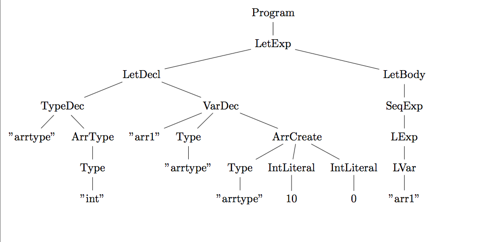

# Higer (Tiger + Haskell)


### Setting up the project
* Install stack by following the instructions on the official [stack](https://docs.haskellstack.org/en/stable/README/) page. 
* Stack sets up a separate environment for the project which does not interfere with  the already installed GHC and libraries.

Run the project as follows:
```
$> chmod 755 show_tree.sh
$> ./show_tree.sh programs/array1.tig 
```

#### Example 

##### Input
```
let
	type  arrtype = array of int
	var arr1:arrtype := arrtype [10] of 0
in
	arr1
end
```

##### Output



### What has been done so far
* Lexical Analysis using Alex
* Parsing using Happy


### Requirements
* [stack](https://docs.haskellstack.org/en/stable/README/)
* [alex](https://www.haskell.org/alex/)
* [happy](https://www.haskell.org/happy/)
* [Latex with forest package](https://www.ctan.org/pkg/forest?lang=en)


