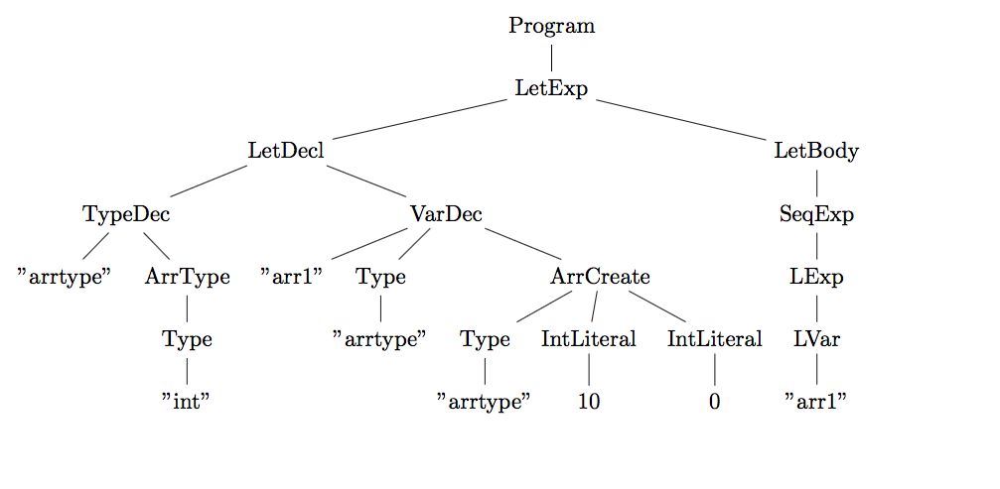

# Higer (Haskell + Tiger)


### Setting up the project
* Install stack by following the instructions on the official [stack](https://docs.haskellstack.org/en/stable/README/) page. 
* Stack sets up a separate environment for the project which does not interfere with  the already installed GHC and libraries.

Run the project as follows:
```
$> chmod 755 syntax_tree.sh #Create syntax tree phase
$> chmod 755 semantic.sh #Perform semantic analysis
$> ./syntax_tree.sh programs/array1.tig 

programs/array1.tig
[HIGER]: Input program
let
	type  arrtype = array of int
    var arr1 := arrtype [10] of 0
in
	arr1
end

[HIGER]: Build files
stack build

[HIGER]: Running the parser
echo programs/array1.tig|stack exec Higer-exe

[HIGER]: Parse output
(Program (LetExp (LetDecl (TypeDec ("arrtype") (ArrType (Type ("int")))) (VarDec ("arr1")  Nothing (ArrCreate (Type ("arrtype")) (IntLiteral (10)) (IntLiteral (0)))) ) (LetBody (SeqExp (LExp (LVar ("arr1"))) ))))

[HIGER]: Compiling latex document

[HIGER]: Cleanup

[HIGER]: Opening file

$> #Try examples from programs/semantic error to see semantic phase in action
$> ./semantic.sh programs/array1.tig 
programs/array1.tig
[HIGER]: Input program
let
	type  arrtype = array of int
    var arr1 := arrtype [10] of 0
in
	arr1
end

[HIGER]: Build files
stack build

[HIGER]: Running the semantic analyzer
echo programs/array1.tig|stack exec Higer-exe

[HIGER]: Syntax output
(SType (Type ("arrtype")),fromList [])
```

#### Example 

##### Input
```
let
	type  arrtype = array of int
	var arr1:arrtype := arrtype [10] of 0
in
	arr1
end
```

##### Output Syntax Tree



### What has been done so far
* Lexical Analysis using Alex
* Parsing using Happy
* Semantic analysis 


### Requirements
* [stack](https://docs.haskellstack.org/en/stable/README/)
* [alex](https://www.haskell.org/alex/)
* [happy](https://www.haskell.org/happy/)
* [Latex with forest package](https://www.ctan.org/pkg/forest?lang=en)


